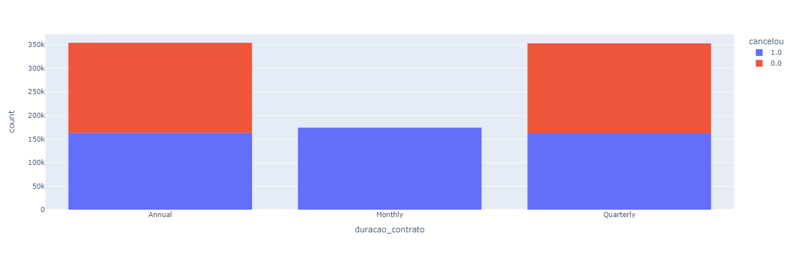

# Relátorio

## Análise dos cancelamentos

Segundo os dados analisados, chegamos a conclusão de que o plano de contrato mensal tem sido o grande causador dos cancelamentos.

    Figura 1 - Representação gráfica da duração de contrato em relação aos cancelamentos

O gráfico acima representa que o plano mensal, possui 100% de cancelamentos, além dele temos outros dados, que são

1 - clientes que fazem mais de 20 ligações ao Call center, cancelam o serviço

2 - clientes com
